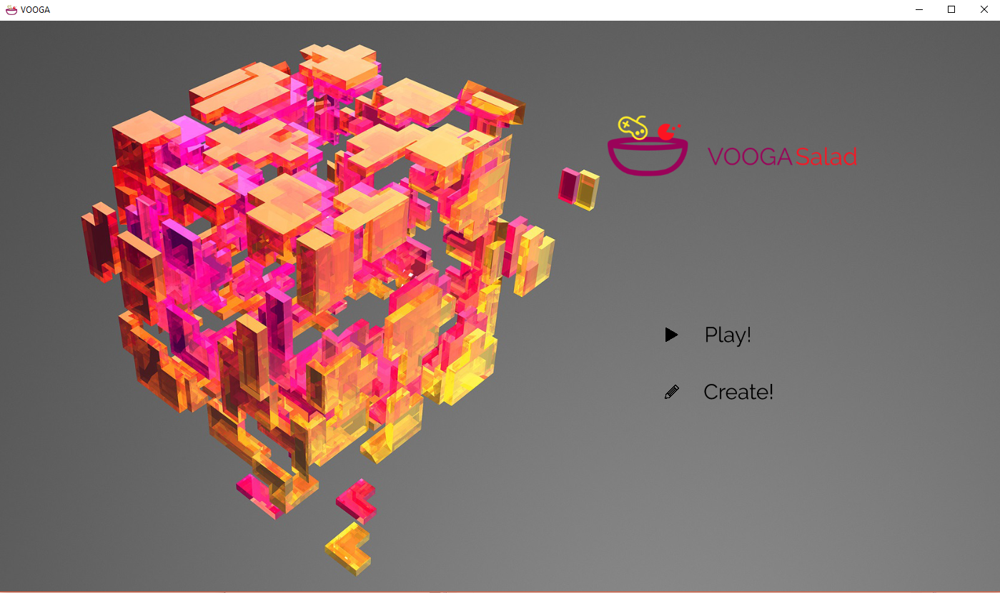
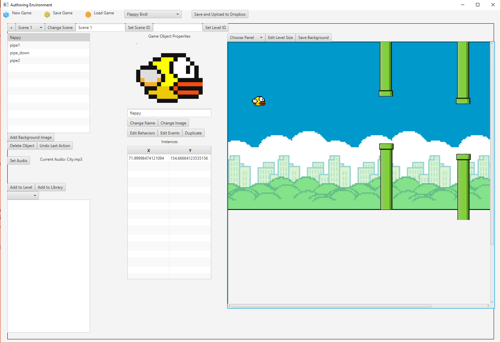
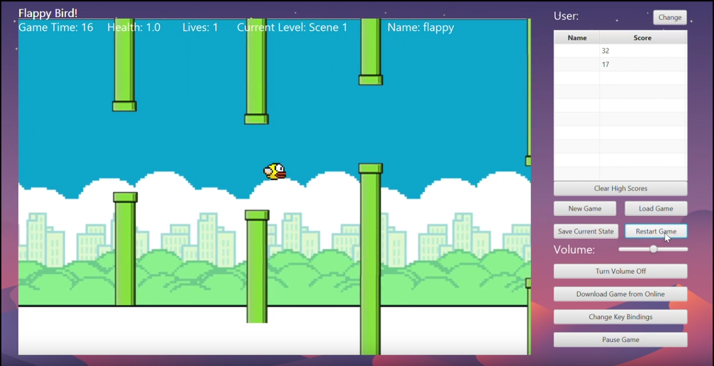

# Voogasalad 

### People who worked on the project

Gouttham Chandraekar, Jeffrey Li, Calvin Ma, Yashas Manjunatha, Martin Muenster, Trishul Nagenalli, August Ning, Summer Smith, Maddie Wilkinson, Edward Zhuang

# About 
VOOGASalad is powerful JavaFX game authoring environment and game platform developed by a ten person team in a series of Agile sprints. The game player features a variety of features, such as high scores, saving/resuming games, and Dropbox integration. Though VOOGASalad was created with scrolling platformer games in mind, the program supports a variety of game genres.

For this project, I developed the game data system which integrated the authoring environment and the game engine. In addition, I also worked extensively on the front end of the authoring environment, implementing a MVC design pattern for ease of future project modification.

